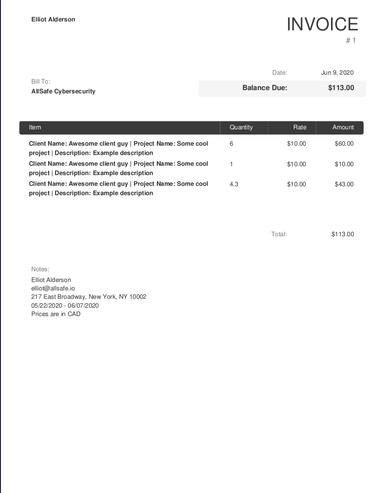

# Clockify Invoice Generator

This tool allows you to use a data dump from Clockify to generate a PDF invoice

### Usage

1. Use the provided [example.config.json](example.config.json) file to customize the generated invoice.
    - Default expected name for this file is `config.json`, but filepath can be passed via command line argument using the `-c` flag
2. Retrieve a data dump of time entries for Clockify by:
    1. Navigating to the [DashBoard](https://clockify.me/dashboard)
    2. Select the invoice date period in the top right hand corner
    3. Opening the JavaScript console (right click the page and select `inspect`)
    4. Navigating to the `Network` tab
    5. Click the `clear` icon in the top left part of the console (looks like a circle with a slash through it)
    6. Changing the default `Top 10` selection in the `Most Tracked Activities` section to `All`
    7. You should see a response with a `name` similar to: `https://global.api.clockify.me/workspaces/5aa8c6ceb12345693e9b90c7/reports/mostTracked?count=ALL&start=2020-05-22T00:00:00.000Z&end=2020-06-07T23:59:59.999Z`
    8. Right click the `name` and select `Copy > Copy response`
    9. In the directory you've installed the binary in, create a file called `dataDump.json` (or whatever you'd like) and paste what you copied into items
    10. Update the `invoiceDataFilePath` in `config.json` accordingly (should be whatever you named your data dump file)

### Example Generated Invoice

